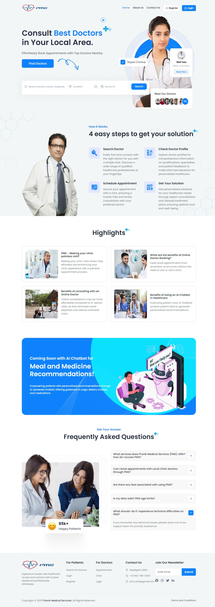

# Pranik Medical Services (PMS)

## Table of Contents
- [Introduction](#introduction)
- [Features](#features)
- [Screenshots](#screenshots)
- [Installation](#installation)
- [Usage](#usage)
- [Contributing](#contributing)
- [License](#license)

## Introduction
Patient Management System (PMS) is a comprehensive web-based application designed to streamline healthcare facilities and enhance patient management. This project aims to provide a centralized platform that allows doctors, patients, and clinic administrators to efficiently manage medical records, appointments, and communication.

The primary objective of the Patient Management System is to improve the patient experience, optimize healthcare provider efficiency, and maintain accurate and secure medical records. By leveraging technology, the system simplifies the management of healthcare facilities and enhances the overall quality of care provided.

## Features
- **Doctor Dashboard:** The system offers a dedicated dashboard for doctors to manage their appointments, view patient records, and update their profiles. Doctors can efficiently organize their schedules and access patient information in a user-friendly interface.
- **Patient Dashboard:** Patients have access to a personalized dashboard that enables them to schedule appointments, access their medical history, and communicate with their doctors. They can easily book appointments, track their healthcare journey, and receive important notifications.
- **Admin Dashboard:** Clinic administrators can efficiently manage doctors, appointments, and clinic information through a comprehensive admin dashboard. They have the ability to add or remove doctors, monitor appointments, and update clinic details, ensuring smooth operations.
- **Appointment Scheduling:** The system facilitates easy and hassle-free appointment scheduling for patients. They can browse through available doctors, view their profiles, and choose a suitable time slot for their appointments. This feature eliminates the need for manual appointment booking and enhances convenience for patients.
- **Electronic Health Records:** Patient medical records are securely stored and managed electronically within the system. Doctors can access comprehensive medical histories, including diagnoses, prescriptions, and test results, enabling them to provide accurate and personalized care.
- **Messaging System:** The platform incorporates an in-built messaging system that facilitates seamless communication between doctors and patients. This feature allows patients to ask questions, seek clarifications, and receive guidance directly from their healthcare providers.
- **Search and Filters:** Users can easily search for doctors and clinics based on various criteria such as location, specialization, availability, and more. The system employs smart filters to refine search results, helping patients find the most suitable healthcare providers.
- **Data Analytics:** The system provides insightful analytics and reports for clinic administrators to monitor and improve service efficiency. They can analyze appointment trends, patient feedback, and performance metrics to make data-driven decisions and enhance overall clinic operations.
- **Responsive Design:** The platform is designed with a responsive layout, ensuring a seamless and consistent user experience across different devices. Whether accessed from a desktop, laptop, tablet, or mobile phone, the system adapts to the screen size and provides optimal usability.

## Screenshots

### Home Page

## Installation
1. Clone the repository: `git clone https://github.com/yadavnikhilrao/Patient-Management-System-Or-Pranik-Medical-Services-PMS.git`
2. Install the required dependencies: `pip install -r requirements.txt`

## Usage
1. Run the application: `python app.py`
2. Access the application in your web browser at: `http://localhost:5000`
3. Live Demo: [https://pranikmedicalservices.pythonanywhere.com/](https://pranikmedicalservices.pythonanywhere.com/)

## Contributing
We welcome contributions from the community to enhance the Patient Management System. If you'd like to contribute, please submit your pull requests.

## License
This project is currently not licensed. All rights reserved.

## Feedback and Suggestions
We value your feedback and suggestions to improve the Patient Management System. Please feel free to share your thoughts and ideas through our [Contact Us](https://pranikmedicalservices.pythonanywhere.com/contact) form. We appreciate your input in making this platform even better and more user-friendly.

Check out the Patient Management System [here](https://pranikmedicalservices.pythonanywhere.com/)!

